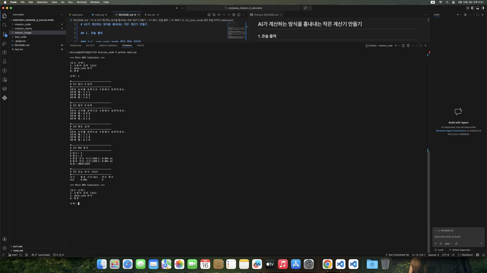
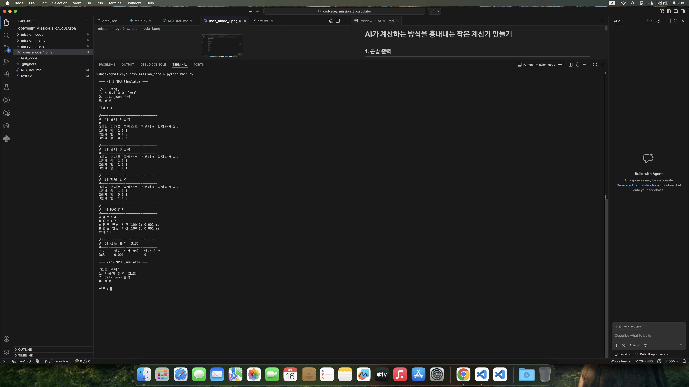
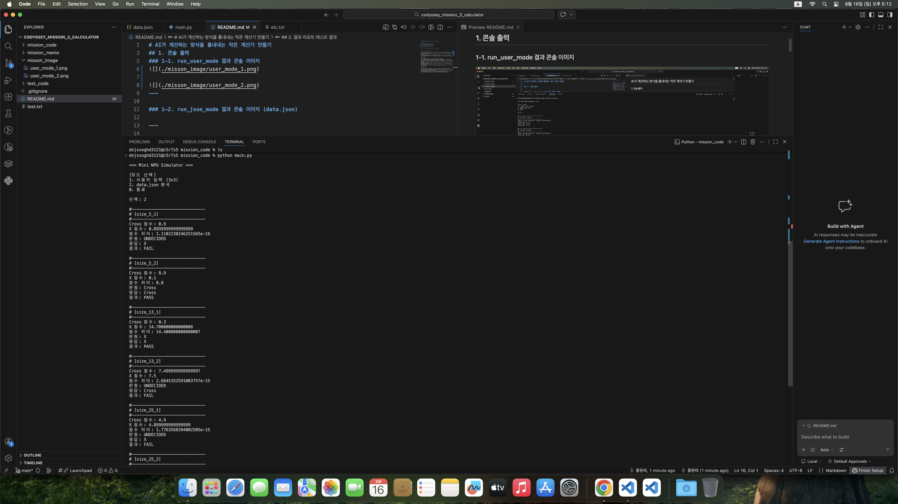
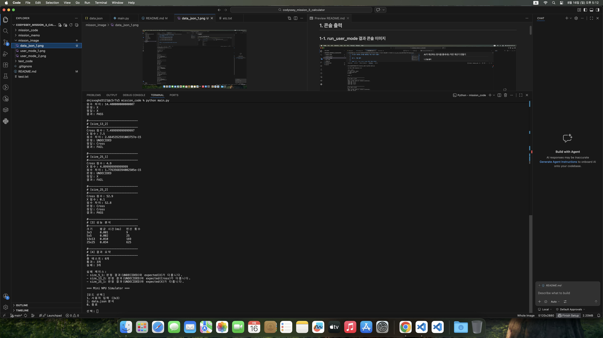

# AI가 계산하는 방식을 흉내내는 작은 계산기 만들기

## 1. 콘솔 출력

### 1-1. run_user_mode 결과 콘솔 이미지

---

### 1-2. run_json_mode 결과 콘솔 이미지 (data.json)

--- 

## 2. 결과 리포트 테스트 결과

data.json 모드에서는 각 패턴에 대해 입력 데이터와 Cross/X 필터의 MAC 점수를 계산하고, 계산 결과를 expected 값과 비교하였다.
전체 테스트 수, 통과 수, 실패 수를 콘솔에 출력하고 실패한 경우 케이스 식별자와 실패 사유를 함께 출력하도록 구현하였다.
패턴의 입력 데이터와 필터는 패턴 이름에 포함된 크기를 기준으로 행렬 크기를 검증한다.
또한 expected와 필터 라벨은 정규화 과정을 거쳐 프로그램 내부에서 X, Cross로 통일하여 비교한다.

실패 원인 분석

현재 테스트에서는 size_25_1 케이스에서 실패가 발생할 수 있다.
해당 케이스의 입력 패턴은 X 모양이지만 Cross 필터의 정중앙 가중치가 4.9로 설정되어 있다.
따라서 Cross 필터의 MAC 점수는 정중앙의 1 × 4.9에 의해 4.9가 된다.
반면 X 필터는 X 모양의 여러 위치에 0.1의 가중치를 가지고 있어 MAC 결과가 4.899999999999999로 계산될 수 있다.
두 점수의 실제 차이는 매우 작기 때문에 classify()에서는 1e-9의 epsilon 기준에 따라 두 점수를 UNDECIDED로 처리한다.
그러나 해당 테스트의 expected 값은 x이므로 정규화 후 X가 되고, 실제 결과 UNDECIDED와 일치하지 않아 FAIL로 처리된다.
이는 MAC 계산 오류라기보다 테스트 데이터의 필터 가중치와 expected 값, 그리고 부동소수점 비교 정책이 함께 작용한 결과이다.

시간 복잡도 분석

MAC 연산은 입력 패턴과 필터의 같은 위치를 이중 반복문으로 순회하면서 곱하고 더한다.
N×N 크기의 입력에서는 바깥 반복문이 N번, 안쪽 반복문도 N번 실행되므로 총 N²번의 위치 연산을 수행한다.
따라서 MAC 연산의 시간 복잡도는 O(N²)이다.
성능 분석에서는 3×3, 5×5, 13×13, 25×25 크기에 대해 MAC 연산을 10회 반복 측정하고 평균 시간을 계산한다.
각 크기의 연산 횟수는 각각 9회, 25회, 169회, 625회이며, 이는 N²에 해당한다.
따라서 입력 크기가 증가할수록 수행해야 하는 MAC 연산 수도 N²에 비례하여 증가한다.